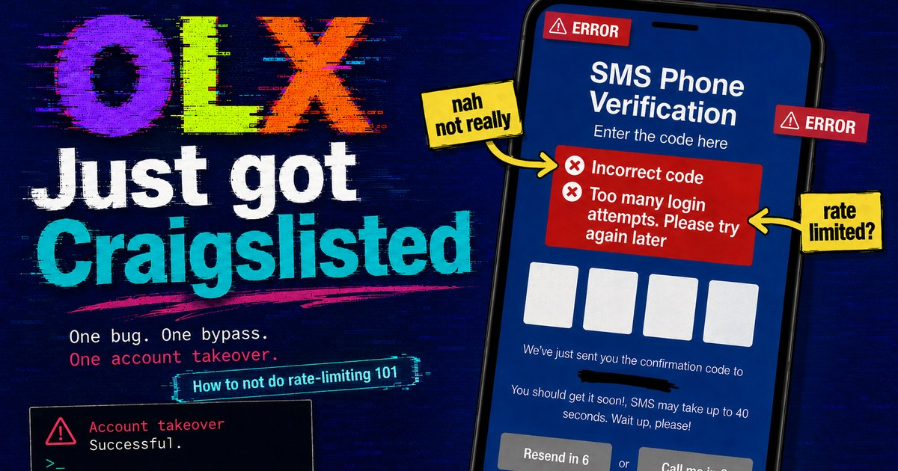

# When “Try Again Later” Still Means “You Guessed Right”

  

  A polished security write-up about an OLX verification-code flaw that still leaked the correct code during lockout and led to account takeover.

  <a href="https://minanagehsalalma.github.io/olx-account-takeover/">Read the article</a>

## What This Repo Is

This repository contains a single GitHub Pages write-up about an OLX verification-code flow that kept revealing whether a submitted code was correct even after the application switched into a lockout state.

That behavior was reused across sensitive account flows, including password reset, which raised the impact to full account takeover. The platform also lacked session revocation on password change, which meant access could persist even after the victim rotated their password.

## Repo Contents

- `index.html` — the published article
- `pages.css` — article styling
- `assets/` — only the images used by the article

## Live Site

- https://minanagehsalalma.github.io/olx-account-takeover/

